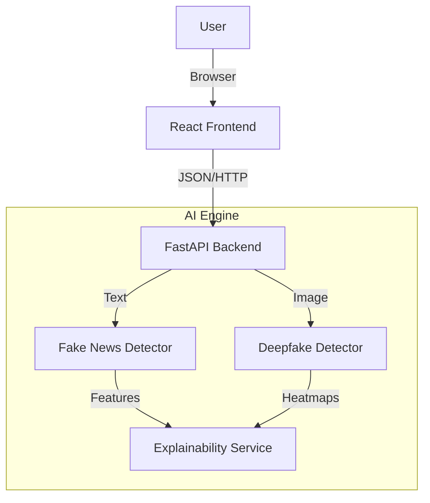

# 🛡️ TruthTracker: Production-Grade Misinformation Detection

[](https://opensource.org/licenses/MIT)
[](https://www.python.org/downloads/)
[](https://reactjs.org/)
[](https://fastapi.tiangolo.com/)
[](https://www.docker.com/)

**TruthTracker** is an advanced AI-powered platform designed to combat digital misinformation. It combines state-of-the-art Natural Language Processing (NLP) and Computer Vision (CV) to detect fake news articles and deepfake images with high accuracy and explainability.

---

## 🚀 Features

### 📰 Fake News Detection
- **Hybrid Architecture:** Uses robust text classification models to analyze article content.
- **Explainability:** Provides **keyword-level analysis** to highlight suspicious terms and patterns (e.g., sensationalism, urgency).
- **Real-time Analysis:** Fast inference for immediate results.

### 🖼️ Deepfake Detection
- **Vision Models:** Utilizes face detection and deep learning classifiers to identify manipulated media.
- **Visual Evidence:** Generates **heatmaps** to visualize analyzed face regions.
- **Format Support:** Handles JPG, PNG, and WEBP formats via drag-and-drop.

### 💻 Modern Interface
- **React + TypeScript:** Type-safe, component-based frontend.
- **Interactive UI:** Real-time confidence bars, dynamic loading states, and responsive design.

---

## 🏗️ Architecture

The system follows a microservices-ready architecture:



---

## ⚡ Quick Start

### Option 1: Docker (Recommended)

Run the entire stack with a single command:

```bash
docker-compose up --build
```

- **Frontend:** http://localhost:3000
- **API Docs:** http://localhost:8000/docs

### Option 2: Local Development

**1. Backend Setup**
```bash
# Navigate to project root
cd "c:\Python Project\AntiAi"

# Install dependencies
pip install -r requirements_prod.txt

# Start API server
python -m uvicorn src.api.main:app --reload
```

**2. Frontend Setup**
```bash
# Navigate to frontend directory
cd frontend

# Install dependencies
npm install

# Start React app
npm start
```

---

## 📚 API Documentation

The backend provides auto-generated Interactive API docs via Swagger UI:

- **Endpoint:** `http://localhost:8000/docs`
- **ReDoc:** `http://localhost:8000/redoc`

### Key Endpoints
| Method | Path | Description |
|--------|------|-------------|
| `POST` | `/api/v1/analyze-news` | Analyze text for fake news indicators |
| `POST` | `/api/v1/analyze-image` | Upload image for deepfake analysis |
| `GET` | `/health` | System health check |

---

## 🤝 Fact-Checking Partners

We align with the **International Fact-Checking Network (IFCN)** principles. Our models are trained on datasets verified by:
- Boom
- Alt News
- The Quint
- India Today Fact Check

---

## 📍 Development Roadmap

This project is being built in distinct phases to ensure production-grade quality.

- [x] **Phase 1: Backend Foundation**
  - FastAPI setup, Fake News & Deepfake detection endpoints, Swagger docs.
- [x] **Phase 2: Frontend Interface**
  - React + TypeScript UI, Real-time analysis, Heatmap visualization.
- [ ] **Phase 3: AI Enhancements (In Progress)**
  - [ ] LIME/SHAP Explainability integration.
  - [ ] EfficientNet-B4 logic for higher accuracy.
  - [ ] Ensemble voting for text classification.
- [ ] **Phase 4: Production Deployment**
  - [ ] Docker containerization (Ready).
  - [ ] Cloud deployment (Railway/Vercel).
  - [ ] CI/CD Pipelines.

---

## 📜 License

This project is licensed under the MIT License - see the [LICENSE](LICENSE) file for details.
