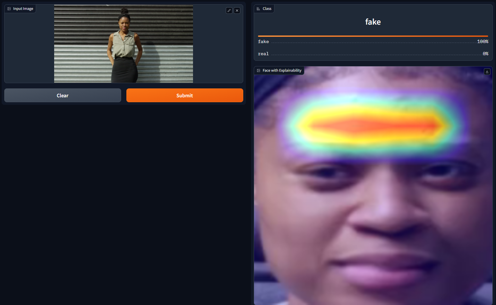
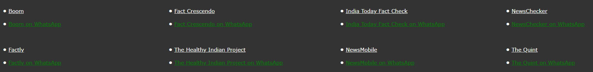

# TruthTracker

## Overview

TruthTracker is a fake news detection system designed to determine the authenticity of news articles. It utilizes machine learning algorithms to classify news articles into two categories: genuine or fake. The system takes advantage of datasets containing labeled examples of both genuine and fake news articles to train and evaluate its performance.

## Usage

### Datasets

Two datasets are provided for training and testing the fake news detection system:

- `true.csv`: Dataset containing genuine news articles.
- `fake.csv`: Dataset containing fake news articles.

### Dependencies

The following Python libraries are required to run TruthTracker:

- pandas
- numpy
- scikit-learn

### Model Architecture

The model architecture for TruthTracker involves using several machine learning classifiers for classifying news articles based on their authenticity. Here's the breakdown of the model architecture:

1. **Data Loading**: The datasets (`true.csv` and `fake.csv`) are loaded into pandas DataFrames for processing.
2. **Data Preprocessing**: Text preprocessing techniques are applied to clean and prepare the news articles for classification.
3. **Feature Extraction**: TF-IDF vectorization is used to convert text data into numerical feature vectors.
4. **Model Training**: Several machine learning classifiers are trained on the labeled dataset to learn patterns and distinguish between genuine and fake news. The classifiers used include:
   - Logistic Regression
   - Decision Tree Classifier
   - Random Forest Classifier
   - Gradient Boosting Classifier
5. **Model Evaluation**: The trained models are evaluated using various metrics such as accuracy, precision, recall, and F1-score to assess their performance in classifying news articles.
6. **Manual Testing**: A function is provided to manually test the fake news detection system by inputting a news article.

This architecture allows for the utilization of multiple machine learning algorithms to classify news articles, providing flexibility and potentially improving the overall performance of the fake news detection system.

### Code

The `TruthTracker.ipynb` notebook contains the implementation of the fake news detection system. It includes the following main components:

1. **Data Loading**: The datasets (`true.csv` and `fake.csv`) are loaded into pandas DataFrames for processing.
2. **Data Preprocessing**: Text preprocessing techniques are applied to clean and prepare the news articles for classification.
3. **Feature Extraction**: TF-IDF vectorization is used to convert text data into numerical feature vectors.
4. **Model Training**: Several machine learning classifiers are trained on the labeled dataset to learn patterns and distinguish between genuine and fake news.
5. **Model Evaluation**: The trained models are evaluated using various metrics such as accuracy, precision, recall, and F1-score.
6. **Manual Testing**: A function is provided to manually test the fake news detection system by inputting a news article.

### Output

The output of the system includes predictions from different classifiers (Logistic Regression, Gradient Boosting, Random Forest) on whether the input news article is genuine or fake.

# Deepfake Detection

## Overview

This project focuses on the detection of deepfake images using machine learning techniques. It employs a combination of facial detection, feature extraction, and model inference to determine whether an image contains a deepfake or not.

## Dependencies

- gradio==3.39.0: Gradio is used to create the user interface for interacting with the deepfake detection system.
- torch==1.11.0: PyTorch is used for deep learning model training and inference.
- facenet-pytorch==2.5.2: This library provides pre-trained models for face detection and feature extraction.
- Pillow==9.4.0: Pillow is a Python Imaging Library (PIL) fork used for image processing tasks.
- opencv-python==4.7.0.72: OpenCV is used for various computer vision tasks such as image manipulation and processing.
- grad-cam==1.4.6: PyTorch Grad-CAM is used for generating class activation maps for model explainability.

## Usage

### Jupyter Notebook

The main code is provided in the `Deepfake_detection.ipynb` Jupyter Notebook. You can run this notebook to understand the implementation details and execute the code interactively.

### Gradio Interface

A Gradio interface is provided for easy interaction with the deepfake detection system. You can launch the interface directly from the notebook or command line.

## Model Architecture

The deepfake detection model consists of the following components:

- **MTCNN (Multi-task Cascaded Convolutional Networks)**: Used for face detection.
- **InceptionResnetV1**: Pre-trained on VGGFace2 dataset for feature extraction.
- **GradCAM (Gradient-weighted Class Activation Mapping)**: Used for generating class activation maps for explainability.

## Examples

*Real Image*

*Fake Image*

## Output Screenshots

# Fact-Checking Partners

We collaborate with independent fact-checking organizations to ensure the accuracy of the information provided in our web application. Our fact-checking partners include:

- **Boom**
- **Fact Crescendo**
- **Factly**
- **The Healthy Indian Project**
- **India Today Fact Check**
- **NewsChecker**
- **NewsMobile**
- **The Quint**
  
These fact-checking organizations review and rate the accuracy of stories, helping us maintain the integrity of our content.

## About IFCN (International Fact-Checking Network)

Our fact-checking partners adhere to the principles outlined by the International Fact-Checking Network (IFCN). The IFCN is a unit of the Poynter Institute dedicated to bringing together fact-checkers worldwide and promoting best practices in fact-checking. By collaborating with IFCN-certified organizations, we ensure transparency, accountability, and accuracy in the fact-checking process.

